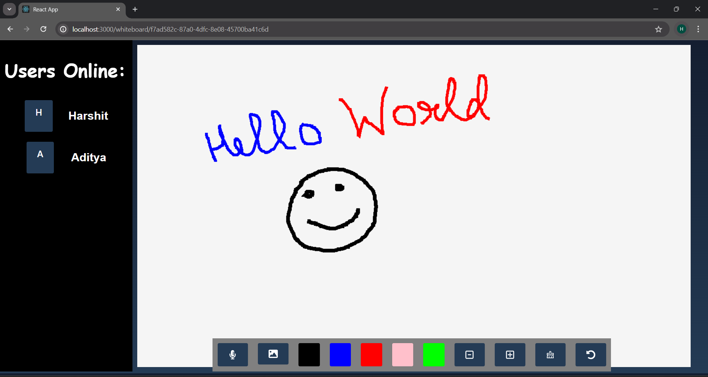

# Real-Time Collaborative Whiteboard

🎨 The Projetc let users collaborate visually for brainstorming and creative purposes in real time. 

## Features

<ul>
<li><b>Real-time Drawing:</b>See others' strokes as they happen.</li>
<li><b>Board Rooms:</b> Unique IDs let you create private collaboration spaces.</li>
<li><b>Undo/Redo:</b> Fix mistakes easily.</li>
<li><b>Image Uploads:</b> Enhance your ideas with visuals.</li>
<li><b>Pen Customization:</b> Change color and width for expressive drawing.</li>
</ul>

## Use Cases

<ol>
<li><b>Brainstorming:</b> Capture ideas together, no matter the distance./li>
<li><b>Creative</b> Collaboration: Sketch, draw, and design collectively.</li>
<li><b>Remote Teaching/Learning:</b> Visual explanations made easy.</li>
</ol>

## Tech Stack
<ul>
<li><b>Frontend:</b> ReactJS, CSS</li>
<li><b>Backend:</b> Node.js</li>
<li><b>Collaboration:</b> Socket.IO</li>
<li><b>Unique IDs:</b> UUID</li>
<li><b>Pop-up Messages:</b> React Toaster</li>
</ul>

## Screenshots

<br>
<br>


## How It Works
<ul>
<li>A user can create a new board unique Id or can joins a existing board room using a unique ID.</li>
<li>Socket.IO establishes a persistent connection between clients and the server.</li>
<li>Drawing, image uploads, and undo are broadcast as events via Socket.IO.</li>
<li>All connected clients receive and render these drawing updates in real time.</li>
</ul>

## Getting Started

### 1.Clone the Repository

```git clone https://github.com/sumraharshit/Real_Time_Collaborative_WhiteBoard.git```

### 2. Install the Dependencies

```npm install```

#### For server
```cd server```
```npm install```

### 3. Start the Server
``` cd server ```
``` nodemon start ```

### 4. Start the Frontend
```cd src```
```npm start```

### 5. Open in Browser
Navigate to http://localhost:3000

## Contributing
Contribution are always welcome. 


